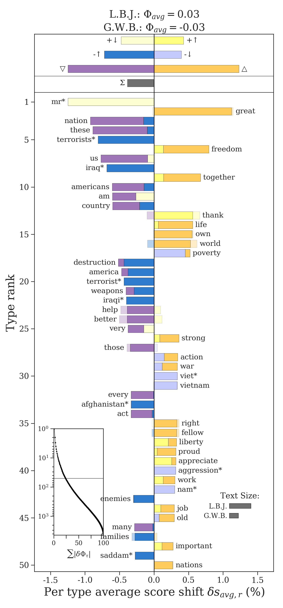

# Shifterator

The Shifterator package provides functionality for constructing **word shift graphs**, vertical bart charts that quantify *which* words contribute to a pairwise difference between two texts and *how* they contribute. By allowing you to look at changes in how words are used, word shifts help you to conduct analyses of sentiment, entropy, and divergence that are fundamentally more interpretable.

  

## Install

Python code to produce shift graphs can be downloaded via pip.

`pip install shifterator`

## Documentation

[The documentation](https://shifterator.readthedocs.io/en/latest/) details how to create various kinds of word shift graphs with Shifterator, and includes a detailed cookbook for how to interpret, visualize, and work with word shifts.

See the following paper for more details on word shifts, and please cite it if you use them in your work:

> Gallagher, R. J., Frank, M. R., Mitchell, Lewis, Schwartz, A. J., Reagan, A. J., Danforth, C. M., Dodds, P. S. (2021). [Generalized Word Shift Graphs: A Method for Visualizing and Explaining Pairwise Comparisons Between Texts](https://epjdatascience.springeropen.com/articles/10.1140/epjds/s13688-021-00260-3). *EPJ Data Science*, 10(4).
