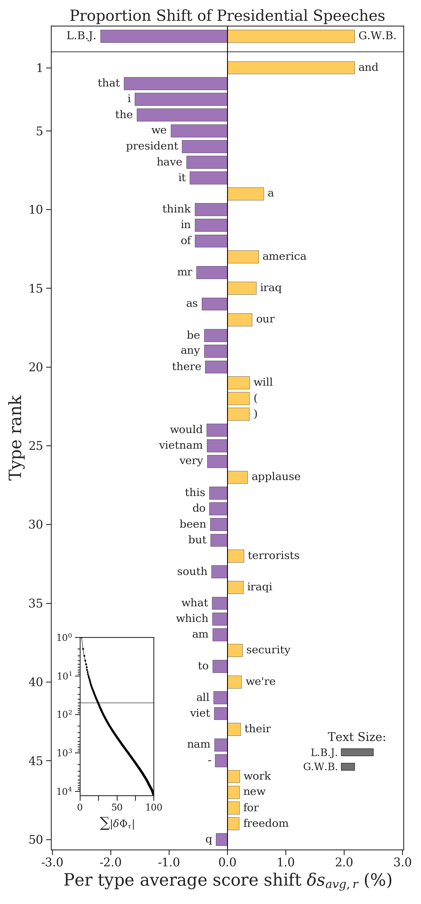
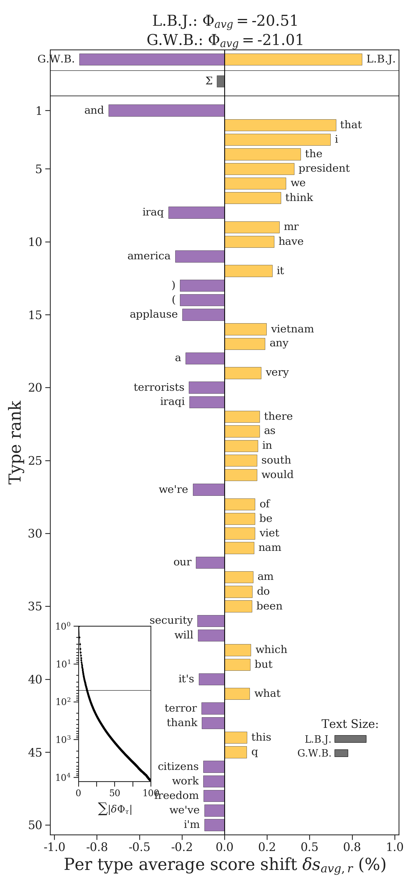
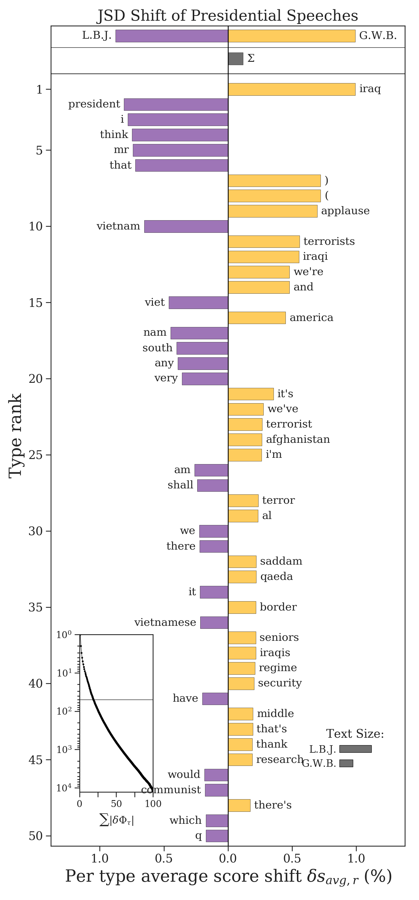

Frequency-Based Shifts
======================

Many word shifts can be constructed using only the frequency counts of how often words appear in each of two texts. The frequencies should be loaded into two dictionaries :code:`type2freq_1` and :code:`type2freq_2`, where keys are word types and values indicate how many times that word appeared in that text.

Proportion Shifts
-----------------

The easiest word shift graph that we can construct is a proportion shift. If :math:`p_i^{(1)}` is the relative frequency of word :math:`i` in the first text, and :math:`p_i^{(2)}` is its relative frequency in the second text, then the proportion shift calculates their difference:

.. math::

    \delta p_i = p_i^{(2)} - p_i^{(1)}.

If the difference is positive (:math:`\delta p_i > 0`), then the word is relatively more common in the second text. If it is negative (:math:`\delta p_i < 0`), then it is relatively more common in the first text. We can rank words by this difference and plot them as a word shift graph.

.. code-block:: python

    proportion_shift = sh.ProportionShift(type2freq_1=type2freq_1,
                                          type2freq_2=type2freq_2)
    proportion_shift.get_shift_graph(system_names = ['L.B.J.', 'G.W.B.'],
                                     title='Proportion Shift of Presidential Speeches')

We see that, for example, Johnson used the word "vietnam" more than Bush, while Bush used the word "iraq" more than Johnson.

There are two diagnostic plots included in the bottom corners of the word shift plot.

1. The first is the cumulative contribution plot, which traces how :math:`\sum_i |\delta p_i |` changes as we add more words according to their rank. The horizontal line shows cutoff of the word contributions that are plotted versus those that are not. This helps show how much of the overal difference between the texts is explained by the top contributing words. In this plot, about a quarter of the overall difference is explained by the top 50 words.

2. The second diagonstic plot shows the relative text size of each corpus, measured by the number of word tokens used. This plot tells us that the Johnson corpus is over twice as large as the Bush corpus (indeed, he made about twice as many speeches).

If we need the relative frequencies :math:`p_i^{(1)}`, they can be accessed through :code:`proportion_shift.type2p_1` and similarly for the second text. The differences :math:`\delta p_i` are available in :code:`proportion_shift.type2shift_score`.

Shannon Entropy Shifts
----------------------

Proportion shifts are easy to interpret, but they are simplistic and have a difficult time pulling out interesting differences between two texts. For example, we see many "stop words" in the proportion shift. Instead, we can use the Shannon entropy to identify more "surprising" words and how they vary between two texts. The Shannon entropy :math:`H` is calculated as

.. math::

    H(P) = \sum_i p_i \log \frac{1}{p_i},

where the factor :math:`-\log p_i` is the *surprisal* of a word. The less often a word appears in a text, the mor surprising that it is. The Shannon entropy can be interpreted as the average surprisal of a text. We can compare two texts by taking the difference between their entropies, :math:`H(P^{(2)}) - H(P^{(1)})`. When we do this, we can get the contribution :math:`\delta H_i` of each word to that difference:

.. math::

    \delta H_i = p_i^{(2)} \log \frac{1}{p_i^{(2)}} - p_i^{(1)} \log \frac{1}{p_i^{(1)}}.

We can rank these contributions and plot them as a Shannon entropy word shift. If the contribution :math:`\delta H_i` is positive, then word :math:`i` the has a higher score in the second text. If the contribution is negative, then its score is higher in the first text.

.. code-block:: python

    entropy_shift = sh.EntropyShift(type2freq_1=type2freq_1,
                                    type2freq_2=type2freq_2,
                                    base=2)
    entropy_shift.get_shift_graph(system_names = ['L.B.J.', 'G.W.B.'])

.. image:: ../figs/shift_entropy.png
    :width: 400
    :alt: Shannon entropy shift graph of speeches by Lyndon B. Johnson and George W. Bush
    :align: center

We now see some more interesting words differentiating Johnson's and Bush's speeches. The title of the word shift graph lists the entropy of president's speeches. These entropies are also plotted relative to one another at the top of the plot, and the bar :math:`\Sigma` shows the direction of their difference. By the title and :math:`\Sigma`, we see that Bush's speeches are slightly more unpredictable. By the cumulative contribution inset in the bottom left hand corner of the word shift graph, we see that the top 50 words explain less 25% of the total difference in entropy between the two texts.

The contributions :math:`\delta H_i` are available in :code:`entropy_shift.type2shift_score`. The surprisals are available in :code:`entropy_shift.type2score_1` and :code:`entropy_shift.type2score_1` respectively.

Tsallis Entropy Shifts
----------------------

The Tsallis entropy is a generalization of the Shannon entropy which allows us to emphasize common or less common words by altering an order parameter :math:`\alpha > 0`. When :math:`\alpha < 1`, uncommon words are weighted more heavily, and when :math:`\alpha > 1`, common words are weighted more heavily. In the case where :math:`\alpha = 1`, the Tsallis entropy is equivalent to the Shannon entropy, which equally weights common and uncommon words.

The contribution :math:`\delta H_i^{\alpha}` of a word to the difference in Tsallis entropy of two texts is given by

.. math::

    \delta H_i^{\alpha} = \frac{-\bigl(p_i^{(2)}\bigr)^\alpha + \bigl(p_i^{(1)}\bigr)^\alpha}{\alpha - 1}.

The Tsallis entropy can be calculated using :code:`EntropyShift` by passing it the parameter :code:`alpha`.

.. code-block:: python

    entropy_shift = sh.EntropyShift(type2freq_1=type2freq_1,
                                    type2freq_2=type2freq_2,
                                    base=2,
                                    alpha=0.8)
    entropy_shift.get_shift_graph(system_names = ['L.B.J.', 'G.W.B.'])

Kullback-Leibler Divergence Shifts
----------------------------------

The Kullback-Leibler divergence (KLD) is a useful asymmetric measure of how two texts differ. One text is the reference text and the other is the comparison text. If we let :code:`type2freq_1` be the reference text and :code:`type2freq_2` be the comparison text, then we can calculate the KLD as

.. math::

    D^{(KL)}(P^{(2)} || P^{(1)}) = \sum_i p_i^{(2)} \log \frac{p_i^{(2)}}{p_i^{(1)}}

A word's contribution can be written as the difference in surprisals between the reference and comparison text, similar to the Shannon entropy except weighting each surprisal by the frequency of the word in the comparison.

.. math::

    \delta KLD_i = p_i^{(2)} \log \frac{1}{p_i^{(1)}} - p_i^{(2)} \log \frac{1}{p_i^{2}}

The contribution is positive if :math:`p_i^{(2)} > p_i^{(1)}`. Similarly, it is negative if :math:`p_i^{(2)} < p_i^{(1)}`.

.. warning::

    The KLD is only well-defined if every single word in the comparison text is also in the reference text. If :math:`p_i^{(2)} > 0` and :math:`p_i^{(1)} = 0` for even a single word :math:`i`, then the KLD diverges to infinity.

The KLD is easily called from :code:`shifterator`.

.. code-block:: python

        kld_shift = sh.KLDivergenceShift(type2freq_1=type2freq_1,
                                         type2freq_2=type2freq_2,
                                         base=2)
        kld_shift.get_shift_graph()

The total Kullback-Leibler divergence be accessed through :code:`kld_shift.diff`.

Jensen-Shannon Divergence Shifts
--------------------------------

The Jensen-Shannon divergence (JSD) accounts for some of the pathologies of the KLD. It does so by first creating a mixture text :math:`M`,

.. math::

    M = \pi_1 P^{(1)} + \pi_2 P^{(2)},

where :math:`\pi_1` and :math:`\pi_2` are weights on the mixture between the two corpora. The JSD is then calculated as the average KLD of each text from the mixture text,

.. math::

    D^{(JS)} \bigl(P^{(1)} || P^{(2)}\bigr) = \pi_1 D^{(KL)} \bigl(P^{(1)} || M \bigr) + \pi_2 D^{(KL)} \bigl(P^{(2)} || M \bigr)

If the probability of a word in the mixture text is :math:`m_i = \pi_1 p_i^{(1)} + \pi_2 p_i^{(2)}`, then an individual word's contribution to the JSD can be written as

.. math::

    \delta JSD_i = m_i \log \frac{1}{m_i} - \biggl( \pi_i p_i^{(1)} \log \frac{1}{p_i^{(1)}} + \pi_2 p_i^{(2)} \log \frac{1}{p_i^{(2)}} \bigg)

.. note::

    The JSD is well-defined for every word because the KLD is taken with respect to the mixture text :math:`M`, which contains every word from both texts by design. Unlike the other measures, a word's JSD contribution is always positive, so we direct it in the word shift graph depending on the text in which it has the highest relative frequency. A word's contribution is zero if and only if :math:`p_i^{(1)} = p_i^{(2)}`.

Like the Shannon entropy, the JSD can be generalized using the Tsallis entropy and the order can be set through the parameter :code:`alpha`.

.. code-block:: python

    jsd_shift = sh.JSDivergenceShift(type2freq_1=type2freq_1,
                                     type2freq_2=type2freq_2,
                                     weight_1=0.5,
                                     weight_2=0.5,
                                     base=2,
                                     alpha=1)
    jsd_shift.get_shift_graph(system_names = ['L.B.J.', 'G.W.B.'],
                              title='JSD Shift of Presidential Speeches')

Quite often the JSD is effective at pulling out distinct words from each corpus (rather than "stop words"), but it is a more complex measure and so it is harder to properly interpret it as a whole.

The total Jensen-Shannon divergence be accessed through :code:`jsd_shift.diff`.
