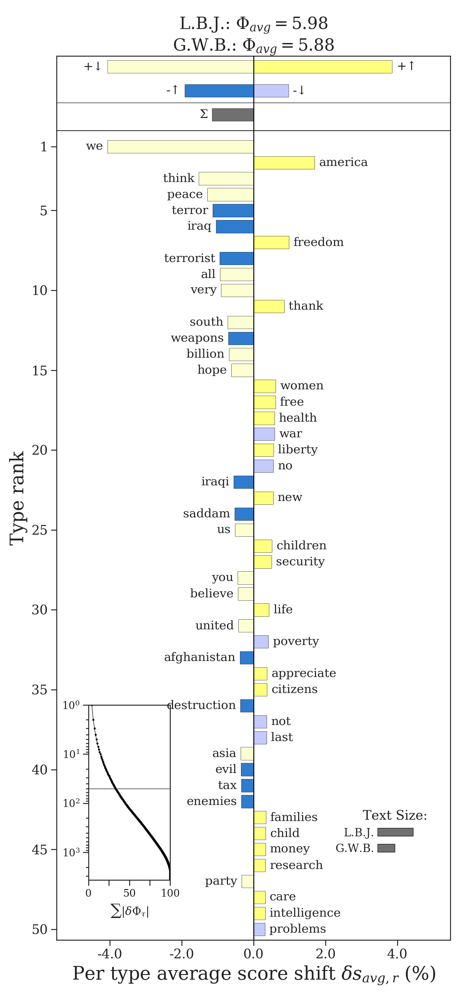
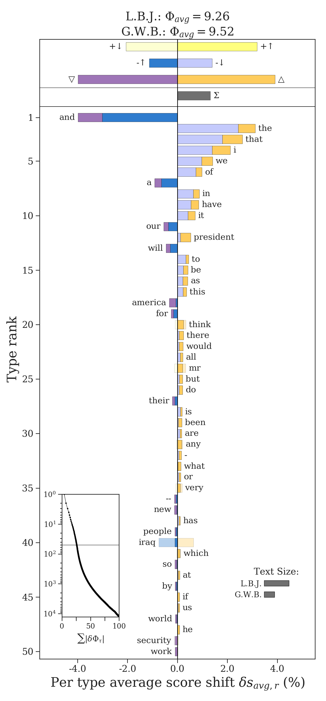

Weighted Average Shifts
=======================

Word shift graphs are particularly effective when a measure can be written as a weighted average or difference in weighted averages. Let :math:`\phi_i^{(1)}` and :math:`\phi_i^{(2)}` denote the weight, or score, of word :math:`i` in each of our texts. Then the weighted average :math:`\Phi` of a text is written as

.. math::

    \Phi = \sum_i \phi_i p_i,

and the difference between two texts is

.. math::

    \delta \Phi = \Phi^{(2)} - \Phi^{(1)} = \sum_i \phi_i^{(2)} p_i^{(2)} - \phi_i^{(1)} p_i^{(1)}

The word shift framework identifies not just *which* words contribute the most to this difference, but *how* they do so.

Reference Scores and Basic Word Shifts
--------------------------------------

First consider the case where the word scores do not depend on the texts, i.e. :math:`\phi_i^{(1)} = \phi_i^{(2)} = \phi_i`. For example, we may have a single sentiment dictionary and words are assigned scores from that dictionary. We can rewrite the difference :math:`\delta \Phi` as

.. math::

    \delta \Phi = \sum_i \bigl( p_i^{(2)} - p_i^{(1)} \bigr) \bigl(\phi_i - \Phi^{(ref)} \bigr),

where :math:`\Phi^{(ref)}` is a *reference score*.

We use reference scores to distinguish between different regimes of interest in word scores. For example, in the case of sentiment analysis, we not ony know each word's score, we also know qualitatively whether that word is more or less positive. We know that "sunshine" is a relatively happy word and that "terror" is a relatively negative word. We can encode that qualitative knowledge into our word shift scores using the reference value. If our dictionary scores range from 1 to 9, we may set the reference value to :math:`\Phi^{(ref)} = 5`, the center of our scale. Or, we may take the average sentiment of our first text and set :math:`\Phi^{(ref)} = \Phi^{(1)}`, and so a word is relatively positive if it is even more positive than the overall sentiment of the first text.

.. note::
    The reference score can be set to any value that distinguishes between different score regimes of interest. It does not change the overall weighted average of a text.

Using the reference score allows us to identify four qualitatively different ways that a word contributes:

.. math::

    \delta \Phi_i = \underbrace{\bigl( p_i^{(2)} - p_i^{(1)} \bigr)}_{\uparrow / \downarrow} \underbrace{\bigl(\phi_i - \Phi^{(ref)} \bigr)}_{+/-}

1. A relatively positive word (+) is used more often (:math:`\uparrow`) in the second text (less in the first text)
2. A relatively positive word (+) is used less often (:math:`\downarrow`) in the second text (more in the first text)
3. A relatively negative word (-) is used more often (:math:`\uparrow`) in the second text (less in the first text)
4. A relatively negative word (-) is used less often (:math:`\downarrow`) in the second text (more in the first text)

To show an example, we compare the average sentiment of Bush's and Johnsonn's speeches (we talk specifically about sentiment analysis in :code:`shifterator` later on).

.. code-block:: python

    sentiment_shift = sh.WeightedAvgShift(type2freq_1=type2freq_1,
                                          type2freq_1=type2freq_2,
                                          type2score_1='labMT_English',
                                          reference_value=5,
                                          stop_lens=[(4,6)])

    sentiment_shift.get_shift_graph(detailed=False,
                                    system_names=['L.B.J.', 'G.W.B.'])

The four types of contributions are indicated by four different types of bars. Bush's speeches were more negative than Johnson's. The word shift graph tells us that this is partly due to his use of more relatively negative words like "terror" and "weapons". It is also due to *less* usage of relatively positive words like "peace" and "hope", words that Johnson used more. Bush did use words like "freedom" and "health" more than Johnson, which are relatively positive words that offset some of the negativity of Bush's speeches (they would be more negative had he not used those words more). Similarly, his speeches are not as negative as they could be because he used negative words like "war" and "no" less than Johnson. The relative total of each type of contribution is shown at the top of the word shift plot.

.. note::
    Knowing which text is :code:`type2freq_1` and which is :code:`type2freq_2` is important for correctly interpretting the word shift graph. Remember, the word shift calculates :math:`\Phi^{(2)} - \Phi^{(1)}`, and so a word's contribution should be interpreted with respect to how it increases or decreases that difference.

Multiple Word Scores and Generalized Word Shifts
------------------------------------------------

Let us return the situation where the scores :math:`\phi_i^{(1)}` and :math:`\phi_i^{(2)}` depend on the texts themselves. For example, we may use two different sentiment dictionaries, one adapted to how words are used in each text specifically. We can generalize the word shift to quantify how the difference in scores also affects a word's contribution:

.. math::

    \delta \Phi_i = \underbrace{\biggl(p_i^{(2)} - p_i^{(1)} \biggr)}_{\uparrow / \downarrow} \underbrace{\biggl(\frac{1}{2} \bigl(\phi_i^{(2)} + \phi_i^{(1)} \bigr) - \Phi^{(ref)}\biggr)}_{+/-} + \underbrace{ \frac{1}{2} \biggl(p_i^{(2)} + p_i^{(1)}\biggr)\biggl(\phi_i^{(2)} - \phi_i^{(1)}\biggr)}_{\bigtriangleup / \bigtriangledown}

This equation is less initimidating than it may first seem. Suppose :math:`\phi_i^{(1)} = \phi_i^{(2)}` like before. Then the second term in the sum disappears, and we once again have the word contribution formula for the basic word shift. So what has changed is that we have a new component which measures the difference between scores (:math:`\bigtriangleup / \bigtriangledown`) weighted by the average relative frequency, and in the first component we now look at the difference between the average word score and the reference score.

A word's score can be higher in the second text (:math:`\bigtriangleup`) or in the first text (:math:`\bigtriangleup`). Because the score difference component is in addition to what we had before, we now have *eight* qualitatively different ways a word can contribute.

.. code-block:: python

    sentiment_shift = sh.WeightedAvgShift(type2freq_1=type2freq_1,
                                          type2freq_1=type2freq_2,
                                          type2score_1='SocialSent-historical_1960',
                                          type2score_2='SocialSent-historical_2000')

    sentiment_shift.get_shift_graph(system_names=['L.B.J.', 'G.W.B.'])

.. image:: ../figs/shift_sentiment_detailed_full.png
    :width: 400
    :alt: Generalized sentiment shift graph of speeches by Lyndon B. Johnson and George W. Bush
    :align: center

The changes in score are represented by stacked bars. For example, not only did Bush use "destruction" more than Johnson, a relatively negative word, but the word was also considered more negative in the 2000s than the 1960s. Bush used "freedom" more than Johnson, a relatively negative word, and it increased in positivity from the 1960s to the 2000s.

.. note::

    The additivity also means that the change in score can counteract the other word shift component, as with "thank" or "help". These interactions are indicated by faded bars, where the overall final contribution is shown as a solid color.

Working with Weighted Average Shifts
------------------------------------

Providing Weights
~~~~~~~~~~~~~~~~~

Weights, or scores, can be provided to any weighted average shift through the dictionaries :code:`type2score_1` and :code:`type2score_2`.

.. code-block:: python

    weighted_shift = sh.WeightedAvgShift(type2freq_1=type2freq_1,
                                         type2freq_2=type2freq_2,
                                         type2score_1=type2score_1
                                         type2score_2=type2score_2)

If only one of :code:`type2score_1` or :code:`type2score_2` is specified, then :code:`shifterator` will use the scores from that dictionary for both texts.

Calculating Weighted Averages
~~~~~~~~~~~~~~~~~~~~~~~~~~~~~

The overall weighted average of either system can be calculated using the :code:`get_weighted_score()` function.

.. code-block:: python

    avg1 = weighted_shift.get_weighted_score(self.type2freq_1,
                                             self.type2score_1)
    avg2 = weighted_shift.get_weighted_score(self.type2freq_2,
                                             self.type2score_2)

The overall difference between texts is available through :code:`weighted_shift.diff`.

Setting Reference Scores
~~~~~~~~~~~~~~~~~~~~~~~~

The reference score can be passed via the :code:`reference_value` parameter.

Accessing Word Contribution Components
~~~~~~~~~~~~~~~~~~~~~~~~~~~~~~~~~~~~~~

The different components of the generalized word shift can be accessed through the shift object.

- The difference in relative frequencies (:math:`\uparrow / \downarrow`) is given in the attribute :code:`type2p_diff`
- The difference in scores (:math:`\bigtriangleup / \bigtriangledown`) is given in :code:`type2s_diff`
- The difference between the average score and the reference score (:math:`+ / -`) is given in :code:`type2s_ref_diff`
- The average relative frequency is given in :code:`type2p_avg`
- The overall word shift contributions are stored in :code:`type2shift_score`

Accessing Cumulative Contributions
~~~~~~~~~~~~~~~~~~~~~~~~~~~~~~~~~~

The cumulative total of each type of contribution (the bars presented at the top of the weighted average word shift graphs) are available through the :code:`get_shift_component_sums()` function. It returns a dictionary with keys indicating the different types of contributions.

- :code:`"pos_s_pos_p"`: :math:`+\uparrow`
- :code:`"pos_s_neg_p"`: :math:`+\downarrow`
- :code:`"neg_s_pos_p"`: :math:`-\uparrow`
- :code:`"neg_s_neg_p"`: :math:`-\downarrow`
- :code:`"pos_s"`: :math:`\bigtriangleup`
- :code:`"neg_s"`: :math:`\bigtriangledown`

Frequency-Based Shifts as Weighted Averages
-------------------------------------------

Several of the frequency-based shifts can also be interpreted as weighted averages. This opens up the possibility to conduct analyses using all of the components of a word's contribution. The following frequency-based shifts are also weighted average shifts:

- :code:`ProportionShift`
- :code:`EntropyShift`
- :code:`KLDivergenceShift`
- :code:`JSDivergenceShift`

.. note::

    The proportion shift is a weighted average where all words are uniformly weighted as :math:`\phi_i = 1`, so it cannot be interestingly decomposed using the basic or generalized word shift frameworks.

By default, these shifts display the overall contributions, rather than the detailed component contributions of the :code:`WeightedAvgShift`. They also default to a reference score of zero. To visualize the full details of these shifts, pass the parameter :code:`detailed=True` to the word shift graph call.

.. code-block:: python

    entropy_shift = sh.EntropyShift(type2freq_1=type2freq_1,
                                    type2freq_2=type2freq_2,
                                    reference_value='average')

    entropy_shift.get_shift_graph(detailed=True,
                                  system_names=['L.B.J.', 'G.W.B.'])

The parameter :code:`reference_value='average'` uses the overall weighted average :math:`\Phi^{(1)}` of the first text as the reference value. We can also set :code:`reference_value` to be any float that we determine discerns between different regimes of word scores, e.g. different regimes of surprisal.
